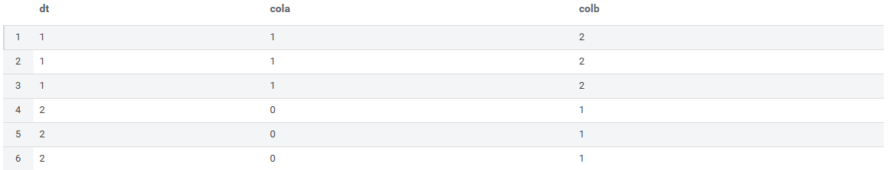
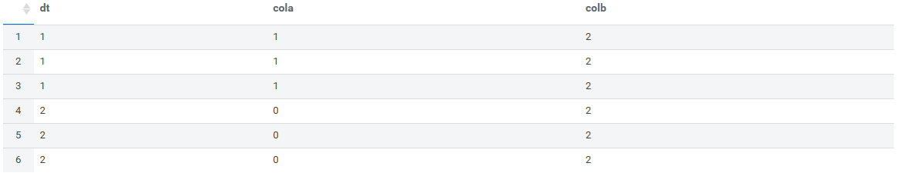
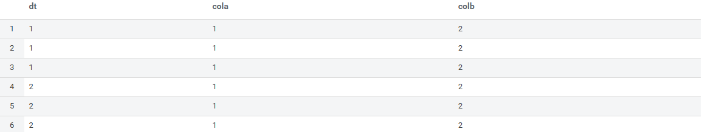
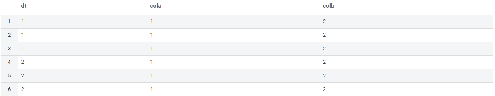

# Impala 테스트

## 테스트 데이터 선정

<!-- <p align="center">표</p> -->
### 데이터프레임 1

|cola|colb|
|:---:|:---:|
|1.0|2.0|
|1.0|2.0|
|1.0|2.0|

저장위치: abfss://data/user/hive/hocean/hs4v2/H0000/dt=1/**file1.parquet**

### 데이터프레임 2

|colc|cola|colb|
|:---:|:---:|:---:|
|0.0|1.0|2.0|
|0.0|1.0|2.0|
|0.0|1.0|2.0|

저장위치: abfss://data/user/hive/hocean/hs4v2/H0000/dt=2/**file2.parquet**

## 테이블 생성

서로 다른 테이블 생성 옵션을 적용한 테이블 생성

- col_test_case1: `TBLPROPERTIES ('parquet.column.index.access'='true')` - 인덱스 기준
- col_test_case2: `TBLPROPERTIES ('parquet.column.index.access'='false')` - 열 이름 기준

```sql
-- col_test_case1 테이블 생성 (parquet 열 순서대로 읽기 옵션)
CREATE EXTERNAL TABLE IF NOT EXISTS tmp.col_test_case1
    (
        cola DOUBLE,
        colb DOUBLE
    )
PARTITIONED BY (dt INTEGER)
STORED AS PARQUET
LOCATION 'abfss://data@dsmeazure.dfs.core.windows.net/user/hive/hocean/hs4v2/H0000/'
TBLPROPERTIES ('parquet.column.index.access'='true');

-- col_test_case2 테이블 생성 (parquet 열 이름 매칭으로 읽기 옵션)
CREATE EXTERNAL TABLE IF NOT EXISTS tmp.col_test_case2
    (
        cola DOUBLE,
        colb DOUBLE
    )
PARTITIONED BY (dt INTEGER)
STORED AS PARQUET
LOCATION 'abfss://data@dsmeazure.dfs.core.windows.net/user/hive/hocean/hs4v2/H0000/'
TBLPROPERTIES ('parquet.column.index.access'='false');
```

## 파티션 생성

생성된 테이블에 동일한 parquet로 파티션 생성

- file1.parquet
- file2.parquet

```sql
-- 1번 파티션 추가
ALTER TABLE tmp.test_case1 ADD PARTITION (dt=1) LOCATION 'abfss://data@dsmeazure.dfs.core.windows.net/user/hive/hocean/hs4v2/H0000/dt=1/file1.pqrquet';

-- 2번 파티션 추가
ALTER TABLE tmp.test_case1 ADD PARTITION (dt=2) LOCATION 'abfss://data@dsmeazure.dfs.core.windows.net/user/hive/hocean/hs4v2/H0000/dt=2/file2.pqrquet';

-- 1번 파티션 추가
ALTER TABLE tmp.test_case2 ADD PARTITION (dt=1) LOCATION 'abfss://data@dsmeazure.dfs.core.windows.net/user/hive/hocean/hs4v2/H0000/dt=1/file1.pqrquet';

-- 2번 파티션 추가
ALTER TABLE tmp.test_case2 ADD PARTITION (dt=2) LOCATION 'abfss://data@dsmeazure.dfs.core.windows.net/user/hive/hocean/hs4v2/H0000/dt=2/file2.pqrquet';
```

## 테이블 조회

### 조회 방법 1

- 일반적인 테이블 조회 구문
- index 기준

```sql
-- col_test_case1 테이블 조회
SELECT dt, cola, colb
FROM tmp.col_test_case1;
```

col_test_case1 조회 결과


```sql
-- col_test_case2 테이블 조회
SELECT dt, cola, colb
FROM tmp.col_test_case2;
```

col_test_case2 조회 결과


### 조회 방법 2

- 테이블 조회 전 `SET PARQUET_FALLBACK_SCHEMA_RESOLUTION = name` 명령어 실행
- 열 이름 기준

```sql
-- 데이터 조회전 설정 (세션이 유지되는 동안만 유효)
SET PARQUET_FALLBACK_SCHEMA_RESOLUTION = name;

-- col_test_case1 테이블 조회
SELECT dt, cola, colb
FROM tmp.col_test_case1;
```

col_test_case1 조회 결과


```sql
-- 데이터 조회전 설정 (세션이 유지되는 동안만 유효)
SET PARQUET_FALLBACK_SCHEMA_RESOLUTION = name;

-- col_test_case2 테이블 조회
SELECT dt, cola, colb
FROM tmp.col_test_case2;
```

col_test_case2 조회 결과


## 열 추가/삭제 테스트

### 열 추가

col_test_case1 테이블에서 `colc` 열 추가

```sql
-- colc 열 추가
ALTER TABLE tmp.col_test_case1 ADD COLUMNS (colc DOUBLE);
```


file1.parquet 파일에는 colc 열이 없기 때문에 NULL 값으로 죄회가 됨

### 열 삭제

col_test_case1 테이블에서 `colb` 열 삭제

```sql
-- colb 열 삭제
ALTER TABLE tmp.col_test_case1 DROP COLUMN colb;
```


## 결론

테이블 생성 시 `TBLPROPERTIES ('parquet.column.index.access'='false')` 옵션과는 관계없이
데이터 조회 시 **`SET PARQUET_FALLBACK_SCHEMA_RESOLUTION = name;`** 명령어를 실행하면
테이블 열 이름과 parquet 파일 열 이름이 매칭되어 데이터가 조회 됨.
열 이름으로 매칭될 경우, 테이블에 새로운 열이 추가되거나 삭제되도 정상적으로 데이터를 조회할 수 있음.
